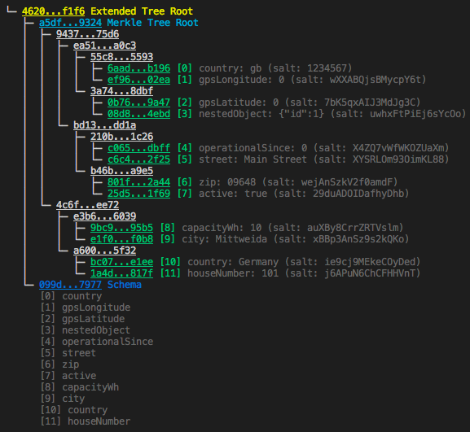

# EWF Origin project's proof-of-concept Precise Proofs implementation

This is a [JS npm package](https://www.npmjs.com/package/precise-proofs-js) and some demo scripts for creating-, verifying- and getting started with Precise Proofs.

This is still a **proof-of-concept (poc)** implementation for demonstration purposes, which should not be used in production, or at least should be used with common sense. We are not responsible for loss of money or leaking of sensitive data.

## What are precise proofs?
Precise Proofs is a "privacy technique" based on Merkle trees to prove that some revealed parts of your document belong to the whole document without revealing other sensitive data. This technique is used in one of Energy Web Foundation’s project called [Certificates of Origin](https://energyweb.org/origin/).
For more information on Precise Proofs, please refer to [EnergyWeb's Privacy wiki page](https://energyweb.atlassian.net/wiki/spaces/EWF/pages/610992129/Privacy+solutions+overview).

This implementation was inspired by [Centrifuge's Precise Proofs implementation in Go](https://github.com/centrifuge/precise-proofs). In our version we emphasized improved security by:
 - making the leaf positions matter in the tree
 - adding the hash of the document schema to the tree as well

to prevent injection/duplicate key attacks and the prover to create phony proofs.

## What do you find here?
 - A small npm package to create and verify proofs yourself
 - Examples (demos), which demonstrate the capabilities and possible vulnerabilities too (for educative purposes)

## Maintainers
**Primary**: Adam Nagy (@ngyam)

Heiko Burkhardt (@hai-ko), who did the heavy lifting and should get the credit for creating this poc.

## Quickstart

In your project:
```bash
npm install precise-proofs-js
```

Then in a JS project:
```javascript
const {PreciseProofs} = require("precise-proofs-js");
[...]

```
Or in a Typescript project:
```javascript
import {PreciseProofs} from "precise-proofs-js"
[...]
```
Unfortunately the code is not documented. For examples look into the **demo files** or read the good source. They are quite intuitive though.

```javascript
console.log(PreciseProofs)
```
```
> { printTree: [Function],
  hash: [Function],
  getRootHash: [Function],
  sortLeafsByKey: [Function],
  sortSchema: [Function],
  canonizeValue: [Function],
  createMerkleTree: [Function],
  hashSchema: [Function],
  createExtendedTreeRootHash: [Function],
  createLeafs: [Function],
  createProof: [Function],
  verifyProof: [Function] }
```

## Demos

After cloning the repo and installing dependencies, you can run the demo scripts with ```npm run demoX```, where X should be replaced by the number of the demo you are interested in.

### Demo 1
Simple proof generation and successful verification example which does not include the schema hash.
### Demo 2
Simple proof generation with a bad proof and failed verification
### Demo 3
Demonstration of an identical key attack in the case you are not including the schema hash.

Lesson: you have to include the schema.
### Demo 4
Demonstration that the prover can literally create any phony merkle roots and proofs if the schema hash is not included.

Lesson: again, you have to include the schema.
### Demo 5
Extended proof generation and successful verification example which includes the schema hash.
### Demo 6
How an identical key attack looks like if you include the schema hash.

Lesson: if you see a published commitment & schema with 2 identical keys, you should not trust any proof for that. In the poc implementation, a duplicate key attack is only possible for the key **first in the "abc" order**, otherwise the verification simply fails (leaf position matters).

### Demo 7
Publishing the merkle root / schema as a commitment to Smart Contract, which the verifier can interact with.
 1. Prover publishes its commitment on-chain to a registry-like smart contract
 2. Prover creates a proof
 3. Prover sends the proof off-chain to the verifier
 4. Verifier reads the commitment on-chain and verifies the proof off-chain

### Demo 8
Creating precise proof and using on-chain verifier to prove. 
 1. Prover creates a proof
 2. Verifier uses on-chain verifier to prove the proof 

## Contributing

Please read [contributing](./CONTRIBUTING.md) and our [code of conduct](./CODE_OF_CONDUCT.md) for details.

## Getting started

### Prerequisites

 - node, npm
 - Truffle, if you want to deploy Smart Contracts

### Installing the deps

```bash
git clone https://github.com/energywebfoundation/precise-proofs.git
cd precise-proofs
npm install -D
```

## Running the tests

```bash
npm test
```

## Versioning

We use [SemVer](http://semver.org/) for versioning.

## License

This project is licensed under GPLv3 - see the [LICENSE](./LICENSE) file for details.

## Limitatons of this poc
 - Not optimized for efficieny/saving space/gas
 - Proof format is not as generic as [Centrifuge's protobuf one](https://github.com/centrifuge/precise-proofs/blob/master/proofs/proto/proof.proto)
 - Nested objects / arrays are flattened out as a big string (minimal support)
 - You can generate a proof for one revealed field at a time
 - Duplicate keys are not prohibited in the schema (but visible)
 - Only JS implementation so far

## Output examples

A document (JSON): 
```
{ operationalSince: 0,
  capacityWh: 10,
  country: 'Germany',
  region: 'Saxony',
  active: true,
  nestedObject: {
    id: 1 },
  zip: '09648',
  city: 'Mittweida',
  street: 'Main Street',
  houseNumber: '101',
  gpsLatitude: '0',
  gpsLongitude: '0' }
```
Leafs:
```
[ { key: 'region',
    value: 'U2F4b255',
    salt: 'LpFp9PDgFfumrYj/',
    hash: 
     '0xa9137a2bea5ce2c04c4406d764ea91044e3f793f9e273732a3bc691c435256a7',
  { key: 'gpsLongitude',
    value: 'MTIuOTgwOTc3',
    salt: 'PPiIor5ZjSb3ISpV',
    hash:
     '0x5c7687899e737d4394bb7f66409441c900f2c2cbc32514e76596115fb6405929' },
...]
```

Extended Merkle Tree:



Proof: 
```
{
  key: 'street',
  value: 'TWFpbiBTdHJlZXQ=',
  salt: 'zcgja7NX7lkC2QRf',
  proofPath: [
    {
      right: '0x1aa21bd98ca498bfdf530f6ef508ef088b3db6b5c3492ff530e695a213cf962e'
    },
    {
      left: '0x8c792b76a96463f40e9c40ab10c203eb0f49d401c25a91f0284158ec34db6255'
    },
    {
      left: '0x570c210a5bb120c6fddab47d59c38b1932b51c262b2fe2434f95d46f93d1b119'
    },
    {
      right: '0xf69d1880dd4b21e9c462fc76e3e59103b86756aa2c775b0bb47a16e079e7c862'
    }
  ]
}
```
